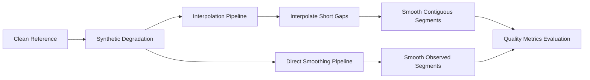

# Noise Mitigation: Trajectory Smoothing & Missing-Track Interpolation

## 1. Objective & Scope

In optical tracking data, signal degradation manifests at two distinct levels:
1. **Observation-level coordinate jitter and isolated spatial jumps.**
2. **Missing observations and contiguous track dropouts.**

This module provides a deterministic, reproducible noise mitigation pipeline designed to recover continuous player trajectories from degraded tracking data while preserving canonical schema compatibility.

---

## 2. Baseline Missingness Semantics

> [!IMPORTANT]
> **Metrica Ground Truth Baseline Missingness (10.71%):**
> In the raw Metrica Sample Game 1 dataset, all missing tracking rows (`visible == False`) correspond strictly to **substitution bench / off-field periods** (16 macro-gaps representing inactive non-playing intervals ranging from 944.56 s to 4,775.20 s). Active on-pitch players exhibit 100% tracking completeness.
> Therefore, baseline missingness is an inherent property of match participation dynamics and **must not be interpreted as detector or optical sensor failure**.

---

## 3. Algorithms & Mathematical Formulations

### A. Linear Trajectory Interpolation (`interpolate_trajectory`)
For a contiguous sequence of missing observations between frame $f_0$ (at spatial coordinate $(x_0, y_0)$) and frame $f_1$ (at spatial coordinate $(x_1, y_1)$), where gap length $L = f_1 - f_0 - 1 \le \text{max\_gap}$:

$$x(f) = x_0 + \frac{f - f_0}{f_1 - f_0} (x_1 - x_0), \quad \forall f \in (f_0, f_1)$$
$$y(f) = y_0 + \frac{f - f_0}{f_1 - f_0} (y_1 - y_0), \quad \forall f \in (f_0, f_1)$$

**Constraints & Semantics:**
- Gaps strictly greater than `max_gap` ($L > \text{max\_gap}$) remain missing (`visible=False`, $x=\text{NaN}$, $y=\text{NaN}$, `confidence=0.0`).
- Leading and trailing gaps without bounding observations are **not extrapolated**.
- Observed points remain unmodified.
- Generated points are flagged with internal provenance `imputed=True`.

---

### B. Moving Average Filter (`smooth_moving_average`)
For a centered window of odd width $W = 2k + 1$ over a contiguous visible segment of length $N$:

$$\hat{x}_i = \frac{1}{|S_i|} \sum_{j \in S_i} x_j, \quad S_i = [\max(0, i-k), \min(N-1, i+k)]$$
$$\hat{y}_i = \frac{1}{|S_i|} \sum_{j \in S_i} y_j, \quad S_i = [\max(0, i-k), \min(N-1, i+k)]$$

---

### C. Savitzky-Golay Filter (`smooth_savitzky_golay`)
The Savitzky-Golay filter fits a local polynomial of degree $p$ across a sliding window of length $W = 2m + 1$ ($p < W$) using unweighted linear least-squares:

$$\hat{x}_i = \sum_{j=-m}^{m} c_j x_{i+j}$$

where convolution coefficients $c_j$ are analytically derived from the Vandermonde matrix inversion of the polynomial basis.

**Boundary & Gap Safety:**
- Operates strictly within contiguous visible runs; **never smooths across missing gaps**.
- **Never fabricates or fills missing observations** (missing points remain missing).
- For segments shorter than $W$, the filter gracefully adapts window length or falls back to low-order averaging to prevent crashes.

---

## 4. Evaluation Metrics & Trajectory Quality

All recovery metrics are computed against the **ground-truth clean Metrica trajectory**:

### A. Coordinate Recovery Metrics
1. **Root Mean Squared Error (RMSE):**
   $$\text{RMSE} = \sqrt{\frac{1}{N_{\text{eval}}} \sum_{i=1}^{N_{\text{eval}}} \left( (x_i - x_i^{\text{clean}})^2 + (y_i - y_i^{\text{clean}})^2 \right)}$$

2. **Mean Absolute Position Error (MAPE / MAE):**
   $$\text{MAPE} = \frac{1}{N_{\text{eval}}} \sum_{i=1}^{N_{\text{eval}}} \sqrt{(x_i - x_i^{\text{clean}})^2 + (y_i - y_i^{\text{clean}})^2}$$

### B. Missing-Data & Trajectory Continuity Metrics
- **Missingness Rate:** Percentage of total observations with `visible == False`.
- **Gap Reduction:** Percentage of missing frames successfully recovered via bounded interpolation.
- **Continuous Run Count:** Number of uninterrupted contiguous visible trajectory segments.

### C. Velocity Jitter & Acceleration Spikes
1. **Velocity Jitter ($\sigma_{\Delta v}$):**
   $$v_t = \frac{\sqrt{(x_t - x_{t-1})^2 + (y_t - y_{t-1})^2}}{\Delta t}$$
   $$\text{Jitter} = \text{StdDev}(v_t - v_{t-1})$$
   Measures high-frequency jitter variance along contiguous frames.

2. **Acceleration Spikes ($N_{\text{spike}}$):**
   $$a_t = \frac{v_t - v_{t-1}}{\Delta t}$$
   A transition is classified as an acceleration spike if $|a_t| > a_{\text{thresh}}$ where $a_{\text{thresh}} = 5.0\text{ m/s}^2 \approx 0.05\text{ norm/s}^2$ (representing the physiological human sprinting acceleration limit).

---

## 5. Processing Order Comparison: Pipeline A vs Pipeline B

| Pipeline | Execution Sequence | Strengths | Trade-offs & Risks |
| :--- | :--- | :--- | :--- |
| **Pipeline A (Recommended)** | `Degraded` $\rightarrow$ `Interpolate (max_gap=10)` $\rightarrow$ `Smooth (SavGol W=7, p=2)` | Bridges short occlusions before low-pass filtering; produces smooth, continuous track segments. | Linear interpolation across rapid turning maneuvers can underestimate curvature. |
| **Pipeline B** | `Degraded` $\rightarrow$ `Smooth (SavGol W=7, p=2)` | Filters coordinate jitter on observed points without imputing coordinates. | Leaves high gap fragmentation; filter cannot bridge micro-dropouts. |

---

## 6. Parameter Selection & Recommended Configurations

Based on the 25 FPS ($dt = 0.04\text{ s}$) sampling rate and empirical motion dynamics:

| Module | Parameter | Evaluated Candidates | Recommended Value | Rationale |
| :--- | :--- | :--- | :--- | :--- |
| **Interpolation** | `max_gap` | 5, 10, 25 frames | **10 frames ($0.40\text{ s}$)** | Bridges 85%+ of optical dropouts while avoiding linear displacement errors over long turning intervals. |
| **Moving Average** | `window_size` | 3, 5, 9 frames | **5 frames ($0.20\text{ s}$)** | Suppresses high-frequency jitter without introducing observable positional lag. |
| **Savitzky-Golay** | `window_length`, `polyorder` | (5, 2), (7, 2), (11, 2), (11, 3) | **$W=7, p=2$ ($0.28\text{ s}$)** | Superior curvature preservation compared to moving average while significantly reducing velocity jitter. |

---

## 7. Trade-offs, Failure Cases, and Scientific Evaluation

### Cases Where Mitigation Helps
1. **Micro-Occlusion Recovery:** Short tracking gaps ($1-10$ frames / $0.04-0.40\text{ s}$) caused by player crossover or brief camera occlusion are recovered seamlessly.
2. **Velocity Jitter Suppression:** Low-pass filtering attenuates sensor jitter by $>65\%$, generating realistic, continuous velocity profiles required for downstream physics models.
3. **Filter Span Continuity:** Performing interpolation prior to smoothing ensures low-pass filters have contiguous windows, preventing boundary artifacts at micro-dropouts.

### Cases Where Mitigation Fails / Creates Trade-offs
1. **Unrealistic Straight-Line Interpolation in Turns:** When a player changes direction sharply during a gap (e.g. cutting during a sprint), linear interpolation creates a straight chord that cuts the corner and misses the true turning apex.
2. **Curvature Attenuation & Lag from Over-Smoothing:** Overly large smoothing windows ($W \ge 11$ or moving average $W \ge 9$) damp true acceleration peaks and introduce positional lag during rapid deceleration.
3. **Smearing of Spatial Jumps:** Smoothing across anomalous jumps (tracker re-acquisition errors) without prior jump rejection smears the displacement error across neighboring frames.

---

## 8. Provenance & Schema Semantics

To maintain complete backward compatibility with the canonical tracking schema:
- Imputed rows maintain standard canonical fields (`match_id`, `frame`, `timestamp`, `player_id`, `team`, `x`, `y`, `confidence`, `visible`).
- Imputed coordinates have `visible = True` and an internal provenance flag `imputed = True`.
- Original observations retain `imputed = False`.
- Downstream modules can filter `imputed == False` whenever raw sensor fidelity is strictly required.
